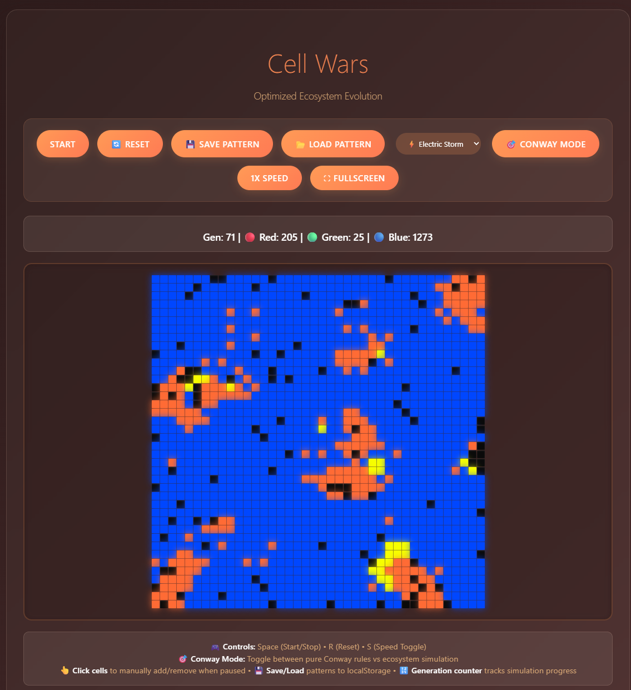

# ⚔️ Cell Wars - Ecosystem Evolution

[]

_A dynamic cellular automaton simulation featuring three competing species in a living ecosystem. Watch as red predators, green symbiotes, and blue parasites evolve, compete, and form complex patterns through birth, survival, and extinction._

> 🎮 **[Play Now](Cell Wars.html)** - Open in any modern web browser

## 🚀 Quick Start

1. **Open** `life-simulationV1.html` in any modern web browser
2. **Click "▶ Start"** or press **Spacebar** to begin
3. **Use controls** to interact with the simulation
4. **Experiment** by clicking cells when paused

### 🎯 Controls

- **▶ Start/Stop**: Spacebar or Start button
- **🔄 Reset**: R key or Reset button
- **⚡ Speed**: S key or Speed button (600ms ↔ 300ms)
- **🎯 Conway Mode**: Toggle between ecosystem and pure Conway rules
- **👆 Edit Cells**: Click cells when paused to add/remove
- **💾 Save/Load**: Store and retrieve patterns
- **🎨 Themes**: Choose from 6 vibrant color schemes

### 📊 Game Modes

- **🧬 Ecosystem Mode**: Species-based evolution with energy mechanics
- **🎯 Conway Mode**: Pure mathematical evolution (all cells equal)

## 🧬 Species Guide

### 🔴 **Red Cells** - Aggressive Predators

**Strategy**: Expansion through predation and competition

- ⚡ **Energy Loss**: 2 per turn (high metabolism)
- 🎯 **Energy Gain**: +3 when hunting green cells
- 👥 **Reproduction**: ≥3 red neighbors + majority advantage
- 💪 **Strength**: Fast reproduction, direct competition
- ⚠️ **Weakness**: High energy requirements, vulnerable to isolation

### 🟢 **Green Cells** - Social Symbiotes

**Strategy**: Community building with blue cell partnerships

- ⚡ **Energy Loss**: 1.2 per turn (moderate metabolism)
- 🤝 **Energy Gain**: +1 from community + blue symbiosis
- 👥 **Reproduction**: ≥3 green neighbors + blue allies + red minority
- 💪 **Strength**: Stable communities, symbiotic bonuses
- ⚠️ **Weakness**: Requires blue support, slow without allies

### 🔵 **Blue Cells** - Resilient Parasites

**Strategy**: Opportunistic survival and low-energy persistence

- ⚡ **Energy Loss**: 0.6 per turn (efficient metabolism)
- 🐛 **Energy Gain**: +2 when exploiting red cells
- 👥 **Reproduction**: ≥3 blue neighbors + can tolerate red presence
- 💪 **Strength**: Low energy needs, parasitic advantages
- ⚠️ **Weakness**: Slow reproduction, needs red hosts nearby

## ✨ Key Features

### 🎮 **Core Gameplay**

- ⚡ **Real-time Evolution**: Watch ecosystems evolve generation by generation
- 🎯 **Dual Modes**: Ecosystem simulation vs pure Conway's Game of Life
- 🎨 **6 Color Themes**: From Fire & Ice to Solar Flare
- 👆 **Interactive Editing**: Click to add/remove cells when paused

### 🔬 **Advanced Systems**

- ⚡ **Energy Dynamics**: Species-specific metabolism and interactions
- 🧬 **Mutation Engine**: 0.3% chance for evolutionary changes
- 🎲 **Random Events**: 0.1% red cell spark generation
- 📊 **Live Statistics**: Population tracking with generation counter

### 🎨 **Visual Excellence**

- 🌈 **Vibrant Cells**: High-contrast colors with glowing effects
- 🎭 **Smooth Animations**: Hover effects and transitions
- 📱 **Responsive Design**: Optimized for all screen sizes
- 🖥️ **Modern UI**: Glassmorphism design with peach theme

### ⌨️ **Controls & Tools**

- 🎹 **Keyboard Shortcuts**: Space, R, S for quick control
- 💾 **Save/Load System**: Store favorite patterns locally
- 🎛️ **Speed Control**: Normal (600ms) and fast (300ms) modes
- 🔄 **Reset Function**: Start fresh anytime

## 🏁 Victory Conditions

The simulation provides different outcomes based on ecosystem dynamics:

### 🏆 **Success States**

- **Harmony**: Balanced populations of all three species coexisting
- **Evolution**: Complex patterns emerging from species interactions
- **Stability**: Self-sustaining ecosystems that persist for many generations

### 💀 **End Conditions**

- **Extinction**: All cells die out - ecosystem collapse
- **Domination**: One species exceeds 30% while others drop below 10
- **Stagnation**: Populations become static with no evolution

## ⚙️ Technical Specifications

### 🎮 **Performance**

- **Grid Size**: 40×40 cells (1,600 total) - optimized for smooth performance
- **Update Rate**: 600ms normal / 300ms fast mode
- **Rendering**: requestAnimationFrame for optimal timing
- **Memory**: Efficient DOM reuse, no element recreation

### 🔧 **Simulation Engine**

- **Language**: Pure JavaScript + HTML5 Canvas-like DOM manipulation
- **Algorithm**: Custom cellular automaton with energy-based evolution
- **Random Events**: Controlled probability systems (0.1% sparks, 0.3% mutations)
- **State Management**: Real-time population tracking and statistics

### 📊 **Data**

- **Initial Energy**: Random 5-10 units per cell
- **Age System**: Internal tracking (no visual dimming for clarity)
- **Species Balance**: Mathematically tuned reproduction rules
- **Persistence**: localStorage for pattern saving

## 📱 Mobile & Cross-Platform

- 📏 **Responsive Design**: Automatic grid scaling (30×30 on mobile)
- 👆 **Touch Optimized**: Large, accessible buttons and controls
- ⌨️ **Keyboard Support**: Full shortcut support on mobile keyboards
- 🌐 **Browser Compatible**: Works in all modern browsers (Chrome, Firefox, Safari, Edge)
- 📦 **Zero Dependencies**: Pure HTML/CSS/JS - no external libraries needed

## 📁 Project Files

- `life-simulationV1.html` - Complete simulation with all features
- `README.md` - This comprehensive documentation
- `screenshot.png` - Game preview image (replace with actual screenshot)
- `screenshot-placeholder.txt` - Instructions for creating screenshot

## 🎯 Ecosystem Strategies

### 🏗️ **Building Stable Communities**

1. **Start Small**: Begin with balanced populations of all three species
2. **Monitor Balance**: Keep populations roughly equal (20-40% each)
3. **Encourage Symbiosis**: Ensure green cells have blue neighbors
4. **Manage Predators**: Don't let red cells overpopulate

### 🧪 **Experimental Scenarios**

- **Pure Conway Mode**: Study mathematical evolution patterns
- **Manual Editing**: Create specific starting conditions
- **Theme Switching**: Observe how colors affect perception
- **Speed Control**: Fast-forward through stable periods, slow down during changes

### 🔬 **Scientific Exploration**

- **Emergent Behavior**: Watch how simple rules create complex patterns
- **Population Dynamics**: Study predator-prey relationships
- **Evolutionary Pressure**: Observe how mutations affect ecosystems
- **Stability vs Chaos**: Compare different starting configurations

## 🛠️ Customization & Modding

### ⚙️ **Easy Modifications**

Edit these variables in the JavaScript section:

```javascript
const ROWS = 40;           // Grid height
const COLS = 40;           // Grid width
const ENERGY_LOSS = {...}; // Species energy costs
const RANDOM_SPARK_CHANCE = 0.001; // Spark probability (0.1%)
```

### 🎨 **Advanced Customization**

- **Reproduction Rules**: Modify `BIRTH_RULES` for different behaviors
- **Color Themes**: Add new themes to the `themes` object
- **UI Styling**: Customize CSS variables and gradients
- **Game Balance**: Adjust energy values and mutation rates

### 🔬 **Research Applications**

- **Population Dynamics**: Study predator-prey relationships
- **Evolutionary Biology**: Observe adaptation and mutation
- **Mathematical Modeling**: Cellular automaton theory
- **Artificial Life**: Emergent behavior studies

## 📈 Development Roadmap

- [x] **Core Simulation Engine** - Energy-based cellular automaton
- [x] **Species Differentiation** - Three unique cell types
- [x] **Interactive UI** - Modern design with controls
- [x] **Performance Optimization** - Smooth 40×40 grid rendering
- [x] **Dual Mode System** - Conway vs Ecosystem modes
- [x] **Theme System** - 6 vibrant color schemes
- [ ] **Advanced Analytics** - Population graphs and statistics
- [ ] **Pattern Library** - Pre-built interesting configurations
- [ ] **Multiplayer Mode** - Collaborative ecosystem building

## 🤝 Contributing

This simulation is open-source and welcomes contributions! Areas for improvement:

- Additional species types
- More complex interaction rules
- Performance optimizations
- New visual themes
- Educational features

## 📄 License & Credits

**Inspired by**: Conway's Game of Life (1970) by John Horton Conway
**Built with**: Pure HTML5, CSS3, and ES6+ JavaScript
**Design**: Modern glassmorphism UI with cellular automaton mathematics

---

<div align="center">

**🌿 Experience the beauty of emergent evolution in your browser! 🌿**

_Made with ❤️ for science, education, and the joy of complex systems_

</div>
